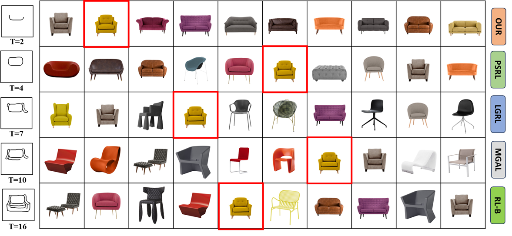
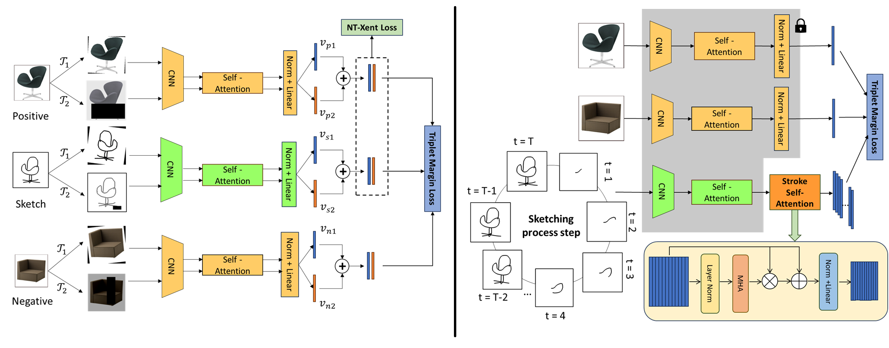

# On-the-Fly Fine-Grained Sketch-Based Image Retrieval with Dual-Channel Contrastive Learning and Stroke Self-Attention 


Illustration of our method’s capability to retrieve the target photo (top-10 list) with fewer strokes compared to SOTA methods such as RL-B, MGAL, LGRL and PSRL. The term T denotes the number of strokes.

## Framework

(1) Phase 1 – FG-SBIR model based on Augmented-view contrastive, using NT-Xent Loss and Triplet Margin Loss. (2) The Stroke Self-Attention is used to learn the relational features among incomplete strokes. The weights of the other part are frozen

## Datasets
QMUL-Shoe-V2 and QMUL-Chair-V2 dataset was used.

## Kaggle ViTS Training

The current default encoder is `ViTS`, using the ImageNet-1k pretrained
`vit_small_patch16_224.augreg_in1k` checkpoint from `timm`.

```bash
git clone https://github.com/HieuNM1804/Onthefly.git
cd Onthefly
pip install -q -r requirements.txt
```

Set the dataset root to the directory that contains `ChairV2` or `ShoeV2`:

```bash
ROOT_DIR=/kaggle/input/datasets/b20dccn616nguynhutun/fg-sbir-dataset
SAVE_DIR=/kaggle/working
DATASET_NAME=ChairV2
```

Train the ViTS baseline:

```bash
python main_baseline.py \
  --dataset_name ${DATASET_NAME} \
  --backbone ViTS \
  --vits_model_name vit_small_patch16_224.augreg_in1k \
  --root_dir ${ROOT_DIR} \
  --save_dir ${SAVE_DIR} \
  --batch_size 64 \
  --epochs 200
```

Fine-tune the same ViTS model with Triplet + InfoNCE:

```bash
python main_baseline.py \
  --dataset_name ${DATASET_NAME} \
  --backbone ViTS \
  --vits_model_name vit_small_patch16_224.augreg_in1k \
  --root_dir ${ROOT_DIR} \
  --save_dir ${SAVE_DIR} \
  --batch_size 28 \
  --load_pretrained True \
  --pretrained_dir ${SAVE_DIR}/${DATASET_NAME}_best_top10.pth \
  --epochs 25 \
  --use_info True \
  --alpha 0.1 \
  --lr 0.00001
```

Train stage 2 with the ViTS checkpoints saved by the baseline stage:

```bash
python main_sketch.py \
  --dataset_name ${DATASET_NAME} \
  --backbone ViTS \
  --vits_model_name vit_small_patch16_224.augreg_in1k \
  --root_dir ${ROOT_DIR} \
  --save_dir ${SAVE_DIR} \
  --pretrained_dir ${SAVE_DIR} \
  --batch_size 48 \
  --epochs 100 \
  --steps 20
```
